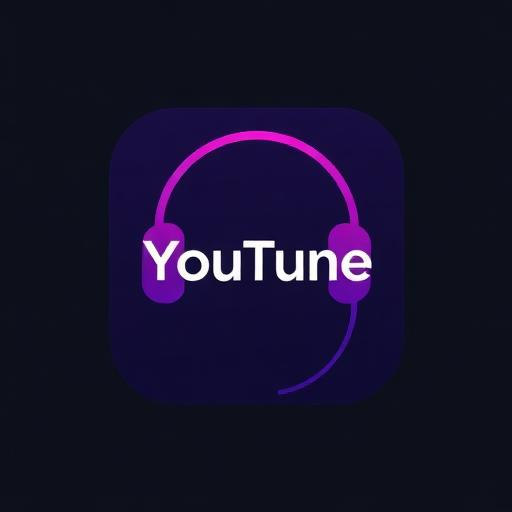

# 🎵 YouTune Music Player

A beautiful, modern music player that streams from YouTube with PWA support for background playback.



## ✨ Features

- **🔍 Smart Search**: Search millions of songs from YouTube
- **🎵 Beautiful Player**: Modern UI with smooth animations and gradients
- **📱 PWA Support**: Install as an app with background playback
- **🎮 Media Controls**: Lock screen and notification controls
- **🔄 Playlist Management**: Queue, repeat, shuffle modes
- **📱 Responsive Design**: Works perfectly on all devices
- **⚡ Fast Performance**: Optimized YouTube API integration
- **🎨 Dark Theme**: Elegant dark interface with purple accents

## 🚀 Getting Started

### Prerequisites

- Node.js 18+ and npm
- YouTube Data API v3 key from [Google Cloud Console](https://console.cloud.google.com/)

### Installation

1. **Clone the repository**
   ```bash
   git clone <YOUR_GIT_URL>
   cd <YOUR_PROJECT_NAME>
   ```

2. **Install dependencies**
   ```bash
   npm install
   ```

3. **Get YouTube API Key**
   - Go to [Google Cloud Console](https://console.cloud.google.com/)
   - Create a new project or select existing one
   - Enable YouTube Data API v3
   - Create credentials (API Key)
   - Restrict the key to YouTube Data API v3

4. **Start development server**
   ```bash
   npm run dev
   ```

5. **Open in browser**
   - Navigate to `http://localhost:8080`
   - The app will prompt for your YouTube API key on first use

## 🎮 How to Use

1. **Search**: Enter song name, artist, or any music-related query
2. **Play**: Click on any track from search results
3. **Controls**: Use the bottom player bar for play/pause, skip, volume
4. **Queue**: Selected search results automatically become your playlist
5. **Repeat/Shuffle**: Toggle modes using the control buttons
6. **Background Play**: Install as PWA for background playback support

## 📱 PWA Installation

### On Mobile (Android/iOS):
1. Open the app in your mobile browser
2. Look for "Add to Home Screen" prompt or menu option
3. Tap "Add" or "Install"
4. The app will now work like a native app with background playback

### On Desktop:
1. Look for the install icon in your browser's address bar
2. Click "Install" to add to your desktop
3. Launch directly from your desktop

## 🛠️ Technology Stack

- **Frontend**: React 18 + TypeScript
- **Styling**: Tailwind CSS + shadcn/ui components
- **APIs**: YouTube Data API v3 + YouTube IFrame Player API
- **PWA**: Service Workers + Web App Manifest
- **HTTP Client**: Axios
- **Build Tool**: Vite
- **State Management**: React Hooks + Context

## 🎨 Design System

YouTune uses a carefully crafted design system:

- **Colors**: Purple/pink gradients (#8b5cf6 to #ec4899)
- **Typography**: Inter font family
- **Theme**: Dark-first with glassmorphism effects
- **Animations**: Smooth transitions and hover effects
- **Responsive**: Mobile-first approach

## 🔧 Configuration

### API Key Management
The app uses your personal YouTube API key for searching. The key is stored locally in your browser and never sent to any third-party servers.

### PWA Features
- **Background Sync**: Caches essential resources
- **Media Session**: Integrates with device media controls
- **Offline Support**: Basic offline functionality

## 📋 API Quotas & Limits

YouTube Data API v3 has daily quotas:
- **Free Tier**: 10,000 units per day
- **Search**: ~100 units per search
- **Video Details**: 1 unit per video

Monitor your usage in [Google Cloud Console](https://console.cloud.google.com/).

## 🚀 Deployment

### Vercel (Recommended)
```bash
npm run build
# Deploy to Vercel via their CLI or GitHub integration
```

### Netlify
```bash
npm run build
# Deploy dist/ folder to Netlify
```

### GitHub Pages
```bash
npm run build
# Deploy dist/ folder to gh-pages branch
```

## ⚖️ Legal & Compliance

**Important**: This app must comply with YouTube's Terms of Service:

- ✅ Uses official YouTube APIs
- ✅ Respects YouTube's branding guidelines
- ✅ Does not download or cache video content
- ✅ Maintains YouTube's attribution requirements
- ❌ Do not block ads (if any are shown)
- ❌ Do not attempt to download copyrighted content

## 🧪 Testing

### Manual Testing Checklist:
- [ ] Search for various music genres
- [ ] Play/pause functionality works
- [ ] Volume control responsive
- [ ] Skip forward/backward
- [ ] Repeat modes (none/all/one)
- [ ] Shuffle mode
- [ ] PWA installation
- [ ] Background playback (mobile)
- [ ] Media session controls (lock screen)
- [ ] Responsive design on all screen sizes

### Error Scenarios:
- [ ] Invalid API key handling
- [ ] Network connectivity issues
- [ ] No search results
- [ ] Video unavailable/restricted

## 🤝 Contributing

1. Fork the repository
2. Create a feature branch
3. Make your changes
4. Test thoroughly
5. Submit a pull request

## 📄 License

This project is for educational purposes. Please respect YouTube's Terms of Service and copyright laws.

## 🔗 Links

- [YouTube Data API Documentation](https://developers.google.com/youtube/v3)
- [YouTube Player API Documentation](https://developers.google.com/youtube/iframe_api_reference)
- [PWA Documentation](https://web.dev/progressive-web-apps/)

---

**YouTune Music Player** - Stream music beautifully 🎵